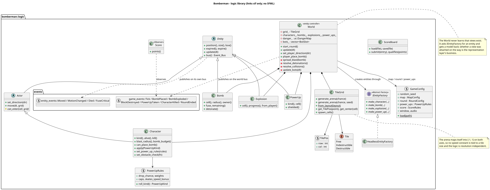
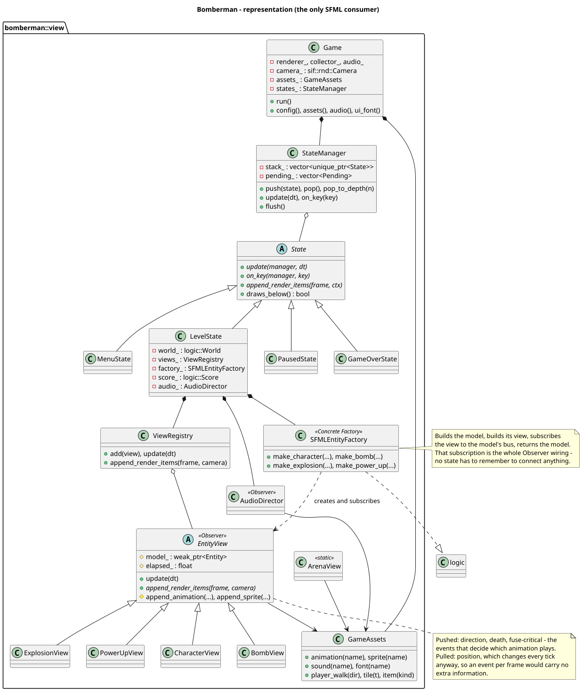
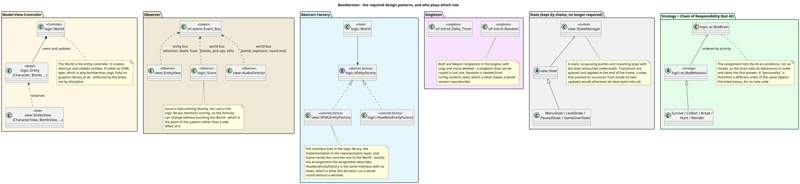
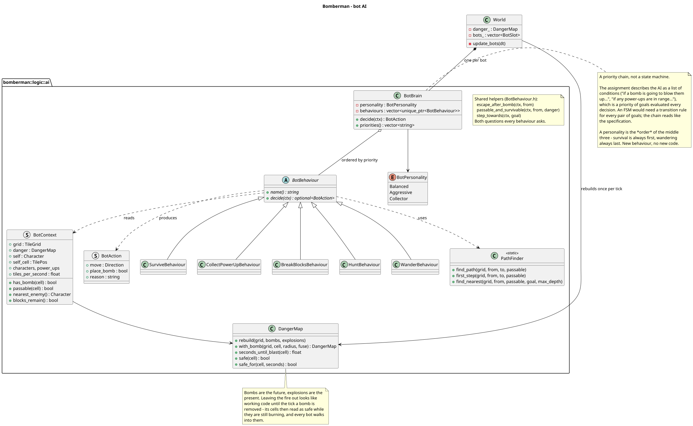

# Bomberman - Advanced Programming 2025-2026 - Project Report

**Contents:** [Front matter](#0-front-matter) · [Architecture](#1-architecture-overview) ·
[Design patterns](#2-design-patterns) · [Bot AI](#3-the-bot-ai) ·
[Technical decisions](#4-notable-technical-decisions) · [Testing](#5-testing) ·
[Use of AI](#6-use-of-ai) · [Limitations](#7-known-limitations) · [Bonus](#8-bonus-features-if-claiming-any)

---

## 0. Front matter

| | |
|---|---|
| **Автор** | Daniil Sukhovii |
| **Студентський номер** | s0240228 |
| **Репозиторій Bomberman** | [Bomberman_2025_2026](https://github.com/sukhoviidaniil/Bomberman_2025_2026) |
| **Репозиторій sif** | [sif](https://github.com/sukhoviidaniil/sif) |

Цей звіт стосується двох репозиторіїв: власне гри Bomberman, та sif - невеликого
рушія (система ассетів, XML-орієнтований UI, конвеєр рендеру, аудіо), який
розроблявся паралельно з грою і використовується нею як залежність. Обидва
розглядаються тут, бо значна частина архітектурної роботи відбувалась саме в sif,
а не лише в самій грі.

---

## 1. Architecture overview

Я вибрав поділити код на дві частини: частину logic/, та частину view/.
Частина logic/ диктує яким чином проходить гра, її логіку, правила гри та поведінку ботів.
Частина logic/ ніколи не задає як гра репрезентується, як її бачить користувач чи як він задає той чи інший крок свого персонажа.

На відмінно від цього частина view/, нічого не знає про конкретні правила гри, яким чином рухаються фігури на дошці.
Частина view/ диктує лише який зараз активний стан програми, як виглядає гра для користувача.
Частина view/ також формально не знає про SFML - всі дії з самим SFML виконує sif, а view/ лише використовує sif.
Це прямо дає можливість замінити не лише версію SFML, але і перевести проект на інших рушій без жодної зміни в обох частин. 

*Класи logic/: World як контролер, ієрархія Entity, IEntityFactory та Score/ScoreBoard.*

*Класи view/: стек станів (StateManager), ієрархія EntityView та конкретна фабрика.*

Прямий факт, а не лише намір: у Bomberman є окрема опція збірки `BOMBERMAN_BUILD_VIEW`.
Коли вона вимкнена (`-DBOMBERMAN_BUILD_VIEW=OFF`), CMake взагалі не заходить у view/ під
час конфігурації - а не просто "не білдить" його. Це важливо саме тому, що CMake обробляє
все дерево CMakeLists.txt на етапі конфігурації незалежно від того, яку ціль потім
попросять зібрати - тож єдиний спосіб довести незалежність logic/ від SFML напевно - це
щоб SFML в принципі не міг бути знайдений чи завантажений у такій конфігурації. Це
перевіряється окремим CI-джобом (`logic`), який ставить систему без SFML взагалі і
конфігурує проект саме з цим прапорцем - якщо raз збірка проходить, а SFML ніде навіть не
згадується в логах, це і є доказ.

Я вибрав створити окремий репозиторія для System Infrastructure Framework (it is
subsequently referred to as SIF or sif), для того щоб:

- винесення інфраструктурного шару в загальну бібліотеку, що дає можливість використання
  цього шару як базу для інших проектів, а не лише для Bomberman;
- ізоляція Графічного Рушія від основного коду;
- узагальнення способу отримання ассетів, не залежно від Графічної Бібліотеки чи
  Бібліотеки звуку;
- узагальнення способі презентації середовища для презентації ассетів;
- чіткий контроль над ативацією, передачею, та життям ассетів;
- створення простого способу для створення нових сцен та модифікацій вже існуючи -
  XML формат.

---

## 2. Design patterns

*Всі чотири патерни разом, лише з учасниками та їх ролями.*

### MVC

logic::World грає роль контролера - саме він створює й знищує сутності, вирішує що
відбувається при зіткненні бомби з персонажем, рухає боти через AI. World ніколи не малює
нічого і взагалі не знає про існування view-шару - у нього немає жодного поля типу
sf::Something чи навіть sif::rnd::Something. Моделлю є підкласи logic::Entity (Character,
Bomb, Explosion, PowerUp) - вони тримають дані (позиція, стан, статистики) і мають
методи для їх зміни, але не мають уявлення про те, як вони виглядають на екрані. View -
це підкласи view::EntityView (CharacterView, BombView, ExplosionView, PowerUpView) - вони
знають лише як намалювати поточний стан моделі, і отримують цей стан через Observer
(нижче), а не питаючи модель напряму щокадру.

### Observer

Конкретно в цьому проекті найбільш значущим використанням є трійця класів: view::EntityView, logic::Score, view::AudioDirector.
view::EntityView слідкує за конкретним sif::event::Event_Bus що є в кожного logic::Entity, щоб слідкувати за такими речами як направлення, стан обьекта, кількість секунд до вибуху бомби.
logic::Score та view::AudioDirector навідмінно від цього слідкують за sif::event::Event_Bus всього logic::World - вони не привязані до якогось конкретного обьєкта в грі, а слідкуючть за всією грою.

Реальним прикладом такого використання може слугувати ланцюжок подій якщо один з ботів помре.
При смерті бот кине у свій sif::event::Event_Bus факт своєї смерті.
Це івент спіймає відповідний view::EntityView та почне програвати анімацію смерті - бот не знає що його показують графічно.
logic::World в свою чергу теж кине узагальнений евент про смерть бота в свій sif::event::Event_Bus.
Цей евент спіймає logic::Score та а view::AudioDirector.
logic::Score відповідно обчислить кількість балів нарахованих за таку подію в logic::World - logic::World нічого не знає про те що його "оцінюють".
view::AudioDirector відповідно вибере програти звук смерті - logic::World нічого не знає що до світу є звукові ефекти.

### Abstract Factory

Інтерфейс logic::IEntityFactory лежить у logic/ і оголошує make_character/make_bomb/
make_explosion/make_power_up. Конкретна реалізація, view::SFMLEntityFactory, лежить у
view/ - вона створює модель (наприклад logic::Bomb) і одразу створює відповідний
view::BombView, підписуючи його на sif::event::Event_Bus щойно створеної моделі. World
отримує вже готову модель і не має уявлення, що при цьому паралельно з'явився й view.
Це саме та властивість, яка дозволяє мати другу, "безголову" реалізацію -
logic::HeadlessEntityFactory - яка створює лише моделі без жодного view. Завдяки цьому
кожен тест у test/ може прогнати цілий раунд гри (World::update, зіткнення, вибухи,
AI ботів) без відкриття вікна і без SFML - HeadlessEntityFactory використовується в усіх
87 тестах.

### Singleton

Цей патерн грає найбільшу роль саме в sif - sif::intrnl::Random та sif::intrnl::Delta_Timer.
Особливо важливим є саме sif::intrnl::Random, бо випадкові числа створюються на багатьох рівнях проекту.
Завдяки цьому патерну нам також вдається зв'язати всі виклики sif::intrnl::Random одним ключем.
Це особливо важливо для тестування, бо ключ sif::intrnl::Random дає можливість до очікуваних та повторюваних тестів.

---

## 3. The bot AI

AI бота побудований як ланцюг пріоритетів (BotBrain + BotBehaviour), а не як
скінченний автомат станів. Причина в тому, як саме сформульоване завдання: "if a bomb is
going to blow them up, they should run to safety", "if any power-ups are in their range,
try to pick them up" і так далі - це список умов, які треба перевіряти щоразу заново, а
не список станів з чіткими переходами між ними. У FSM довелось би явно описувати перехід
з кожного стану в кожен інший (що робити, якщо бот "збирає бонус" і раптом поруч
з'явилась бомба?) - у ланцюга пріоритетів це не проблема: BotBrain просто питає кожну
behaviour по черзі (SurviveBehaviour, потім залежно від особистості бота - HuntBehaviour
чи CollectPowerUpBehaviour - потім BreakBlocksBehaviour, і завжди WanderBehaviour
останньою) і бере першу відповідь, яка не nullopt. "Особистість" бота (BotPersonality:
balanced/aggressive/collector) - це просто інший порядок цих же behaviours, без жодного
нового коду - саме такий бонус описаний в завданні ("give each bot their own
personality").

DangerMap - це структура, яка на кожен тик перебудовується з живих бомб і відповідає на
питання "через скільки секунд ця клітинка загориться" (нескінченність, якщо ніколи).
Важливо, що DangerMap враховує не лише бомби, а й уже палаючі вибухи - спочатку я
рахував лише бомби, і саме це стало причиною бага, описаного нижче.

Конкретний сценарій: бот стоїть на клітинці, поруч з якою за секунду вибухне бомба, а за
дві клітинки лежить power-up. SurviveBehaviour перевіряється першою і бачить, що власна
клітинка бота небезпечна (danger.safe(self_cell) == false) - вона шукає найближчу
клітинку, яку вогонь не дістане, і повертає напрямок туди. CollectPowerUpBehaviour
взагалі не встигає спрацювати, бо BotBrain зупиняється на першій ненульовій відповіді.
Якби бот замість цього побіг за бонусом, це виглядало б як явний баг AI - і саме таку
поведінку я одного разу й спостерігав, поки не виправив DangerMap (нижче).

**Два реальні баги, знайдені під час розробки AI:**

> **Баг 1 - боти вбивали самі себе.** Боти вбивали самі себе власними бомбами буквально
> в перші секунди кожного раунду. DangerMap на той момент рахувала небезпечними лише
> клітинки в радіусі бомб, які ще тікають - але не клітинки, де вогонь уже горить. Бот
> ставив бомбу, вважав що втік (бо DangerMap показувала його нову клітинку як безпечну),
> а насправді ця клітинка вже горіла від вибуху, який стався мілісекундами раніше в тому
> ж кадрі. **Виправлення** - додати до DangerMap ще й живі `logic::Explosion`, не лише
> `logic::Bomb`.

> **Баг 2 - маршрут утечі проходив крізь вогонь.** Після першого виправлення боти все
> одно іноді гинули - цього разу тому, що маршрут до "безпечної" клітинки, знайдений
> PathFinder, міг проходити крізь клітинку, яка на момент прибуття бота вже встигала
> загорітись (шлях вважався безпечним лише в момент пошуку, а не в момент фактичного
> проходження). **Виправлення** - `escape_after_bomb` тепер рахує не просто "чи клітинка
> безпечна зараз", а "чи клітинка все ще буде безпечною через стільки кроків, скільки бот
> реально туди йтиме", використовуючи його ж швидкість.

*BotBrain як ланцюг пріоритетів над п'ятьма BotBehaviour, і DangerMap, з якою вони всі звіряються.*

---

## 4. Notable technical decisions

**Нормалізований світ.** Світ гри нормалізований до координат [-1, 1] замість пікселів. sif::rnd::Camera окремо
проєктує ці координати у пікселі екрана з політикою Fit, тому змінити роздільну здатність
вікна чи навіть співвідношення сторін ніяк не впливає на логіку гри - жодна константа
швидкості чи розміру не прив'язана до конкретного розміру тайла в пікселях.

**`weak_ptr` проти `shared_ptr`.** logic::Bomb тримає std::weak_ptr на персонажа, що її поставив, тоді як logic::World тримає
std::shared_ptr на кожну сутність, якою володіє. Причина - бомба може пережити свого
власника (гравець може підірватися власною бомбою вже після смерті), і weak_ptr тут не
дає бомбі штучно продовжувати життя персонажа, якого вже немає. World, навпаки,
дійсно володіє кожною сутністю - якщо World перестане існувати, всі сутності мають
зникнути разом з ним, тому там shared_ptr - правильне, а не випадкове рішення.

**Відкладені переходи станів.** Переходи між станами (view::StateManager: push/pop) не застосовуються одразу в момент
виклику, а складаються в чергу і застосовуються в кінці кадру. Якщо, наприклад,
LevelState вирішує запушити SaveScoreState прямо всередині свого ж update(), а перехід
відбувся б негайно - LevelState міг би бути знищений (чи його стек викликів зіпсований)
ще до того, як його власний update() закінчив виконуватись. Відкладена черга уникає цього
класу помилок.

**Похибка float у Score.** У logic::Score є константа tolerance при підрахунку цілих секунд виживання. Причина
суто числова: 60 кадрів по 1/60 секунди в сумі дають не рівно 1.0, а 0.99999994f через
похибку float. Без tolerance гравець втрачав би одну секунду нарахування приблизно раз
на хвилину гри - баг, який спершу виглядав як "рахунок іноді відстає", а виявився
класичною похибкою накопичення float.

---

## 5. Testing

Сам проект Бомбермена містить що найменьше 87 тестів. Це прямо покриває конфігурації,
power-ups, поведінку ботів, нормалізацію координат світу, нарахування балів. Загалом
перевіреними є як і частина unit-level behaviour, так і частина end-to-end guards.

Деякі тести були створені саме тому що був знайдений баг і не допрацювання коду.
Прикладом цього може бути один з тестів в `PowerUpTests.cpp`: я забув додати щит для
захисту power_up від вибуху який їх і створив цей power_up зі стіни. Без такого тесту
проблема виглядала абсолютно інакше - power_up здавалося взагалі не з'являлися з блоків.
Схожий баг був з Мапою Небезпеки - вогонь не зараховувався як небезпеку, і боти
вирішували вбити себе.

---

## 6. Use of AI

Використання Штучного Інтелекта в цьому проекті було в багатьох сферах.
Напевно найбільш важливу роль ШІ грав саме ДО початку роботи над цим проектом - аналіз повного коду попереднього проекту, Пакмена.
Це дозволило побачити які моменти були пропущені, які моменти були надлишковими, і дало мені як програмісту зробити висновки не тільки
про проблеми проекту Пакмена, але і про проблеми (які зараз вирішені) проекту SIF, ще до початку роботи над проектом Бомбермена.
Штучний Інтелект допоміг проаналізувати помилки знайдені мною, як от лінкування SFML
та гонки всередині системи SIF- debugging with sanitizer tools, після мого запиту на це.
Штучний Інтелект допоміг з більшою швидкістю шаблонно переписати описи сцен з C++ до XML - просто перезапис однакової ідеї під інший формат.
Штучний Інтелект допоміг знайти варіанти ассетів для гри - такий пошук міг значно затягнутися,
бо це методичний перегляд багатьох сайтів на конкретні ассети.

Значні помилки були знайдені саме мною, програмістом, але самостійно не помічені ШІ:

- не коректність завантаження версії SFML для системи що має одночасно 2.X і 3.X версії;
- замовчування CI проблеми нестачі json для SIF через `nlohmann-json3-dev`;
- замовчування проблеми зникнення power-ups від вибуху, перевіряючи лише факт створення та підбору ОКРЕМО а не разом.

Також були деякі спроби ШІ, які я, як програміст, відмовив чи переробив:

- розробка інструментів для ассетів під егідою проекту Бомбермена - це прямо порушувало
  архітектурну ціль SIF, принцип Відповідальності;
- спроба "зменшити" роботу копіюючи файли ассетів - дублювання без логічної цілі;
- спроба зробити CMake в SIF залежним від виданого користувачем SFML - повна діра 
для помилок інструментів SIF які залежать від логіки конкретної версії SFML;
- помилки аналізу CMake для пошуку конкретної версії SFML - знайдено, виправлено, та
  описано як дві пастки.

Така відмінність, на мою думку, чітко показує що ШІ був використаний як інструмент для аналізу, перефразування, пошуку, рутинної роботи.

---

## 7. Known limitations

**Накладання елементів у sif.** Одним з помітних лімітів є ліміт SIF - компонувальний двигун не вміє накладати обєкти
один на одного, тому задник для екрану паузи й екрану завершення раунду досі малюється
вручну прямим sif::rnd::Rectangle, а не є частиною *.ui.xml сцени.

**Константи поза конфігом.** Кілька констант балансу (наприклад, як часто бот перепланує свою поведінку) досі лежать
прямо в C++, а не в assets/config.json - на відміну від майже всього іншого (мапа,
power-up'и, таймінги раунду, ваги рахунку), що вже винесено в конфіг.

**Розмір світу впливає на релятивну швидкість руху Акторів.** Це прямо випливає з нормалізації світу - якщо збільшити
кількість клітинок у світі, але не зменшити швидкість руху Акторів, то візуально Актори почнуть рухатися більш швидко.
Це не є багом, бо швидкість Акторів вже внесена в конфігурацію, і відповідно може бути налаштована користувачем відповідно до бажання чи потреби.

**Перемальовування арени щокадру.** Арена перемальовується заново щокадру, хоча змінюється лише коли зникає блок - це
лише питання продуктивності, непомітне на розмірах цієї гри, і не впливає на коректність.

---

## 8. Bonus features, if claiming any

**Особистості ботів.** `logic::ai::BotPersonality` (balanced/aggressive/collector) - прямо
той бонус, який описаний у завданні ("give each bot their own personality"): це той
самий priority chain поведінок, лише в іншому порядку для кожного типу.

**Звук.** `view::AudioDirector` реагує на ігрові події (вибух, підбір бонусу, смерть,
перемога/поразка) через ту саму Observer-шину, якою користується logic::Score - жодних
прямих викликів з логіки гри в аудіо-код.

---

